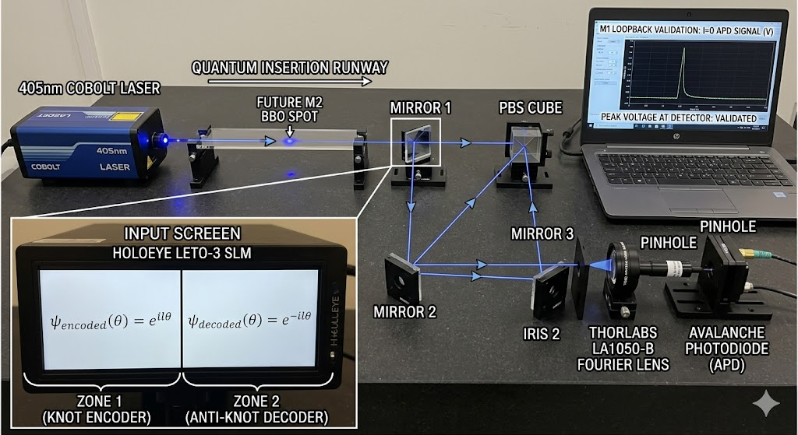

# Photonic Topology Demonstrator

Welcome to the core documentation repository for the Homegrown Photonic Topology Demonstrator. This project implements high-resolution spatial wavefront sculpting via Phase-Only Modulation to encode high-dimensional vector spaces onto the quantized, topologically protected states of Orbital Angular Momentum (OAM). 

By utilizing an integer alphabet range up to $l = \pm24$, we unlock a 48-dimensional configuration space per optical path.

_charlie: We shine a laser through tiny screen with a masked image that twists the light -24 to +24 , which we then control the brightness of per OAM level (-24 to 24) , we can accurately read roughly 64 values per channel , so numbers 0-63 can be represented in each of the 48 channels._
---

## Milestone 1: Classical Validation Sandbox

The primary objective of Milestone 1 is to implement a classical validation loopback configuration. This architecture eliminates quantum alignment complexities (such as photon pair entanglement and coincidence counting) while fully proving out our software control pipeline, spatial light modulator (SLM) coordinate mechanics, and phase-unwrapping algorithms.

### 1. Conceptual Mechanics & Loopback Architecture

Milestone 1 partitions a single **HOLOEYE LETO-3** Phase-Only SLM ($1920 \times 1080$ resolution) into two independent, software-controlled logic zones:

* **Zone 1 (Left Half - Pixels 0 to 959):** Acts as the **Knot Encoder**. It modulates the incoming 405nm single longitudinal mode laser beam, imprinting a multiplexed OAM state:
    $$\psi_{\text{encoded}}(\theta) = e^{i l \theta}$$
* **Zone 2 (Right Half - Pixels 960 to 1919):** Acts as the **Anti-Knot Decoder**. After the beam is physically routed across the optics workbench via a loopback mirror configuration, it strikes Zone 2, which applies the complex conjugate inverse phase mask:
    $$\psi_{\text{decoded}}(\theta) = e^{-i l \theta}$$

$$\Psi_{\text{terminal}}(\theta) = \psi_{\text{encoded}}(\theta) \cdot \psi_{\text{decoded}}(\theta) = e^{i l \theta} \cdot e^{-i l \theta} = e^{0} = 1$$

When the physical alignment and mathematical phase maps correspond exactly, the helical wavefront unwinds back into a flat, planar wavefront ($l = 0$). This flat wavefront passes through a Fourier focusing lens, collapsing into a diffraction-limited spot at the focal plane, triggering a maximum voltage spike on our Avalanche Photodiode (APD) monitored via an NI-DAQ interface.

---

### 2. Physical Beam Path & Hardware Configuration

The physical footprint on the granite optical workbench has been precisely engineered to remain **future-proof**. A dedicated "Quantum Insertion Runway" is provisioned immediately after the laser launch to ensure a seamless transition to Milestone 2 (Type-II Spontaneous Parametric Down-Conversion) without rebuilding the core layout.

#### Optical Bench Component Layout
```
   +-------------------------------------------------------------------------+
   |                                                                         |
   |   [405nm Laser] ---> [Iris 1] ---> [M2 Runway Area] ---> [Mirror 1]     |
   |                                           |                     |       |
   |                                  (Future M2 BBO Spot)           v       |
   |                                                               [PBS]     |
   |                                                                 |       |
   |                                                                 v       |
   |                                                          [SLM Zone 1]   |
   |                                                                 |       |
   |   [APD] <-- [Lens] <-- [Iris 2] <-- [Mirror 3] <-- [Mirror 2] <-+       |
   |                                                                         |
   +-------------------------------------------------------------------------+
```

#### Step-by-Step Physical Alignment Guide

1.  **Launch & Beam Conditioning (The Runway):**
    * Mount the **Cobolt 08-NLD Laser** (405nm, 50mW) parallel to the table's tapped hole matrix.
    * Pass the beam through **Iris 1** to establish the master optical axis ($Z$-axis).
    * *M2 Provisioning:* Maintain a clear **20–30 cm** open path downfield from Iris 1. For Milestone 1, this remains empty air. For Milestone 2, the **Newlight Photonics BBO Crystal** will occupy this slot.
2.  **Beam Steering & Polarization Isolation:**
    * Position **Mirror 1** (Thorlabs Broadband Silver) at the end of the runway to execute a sharp $90^\circ$ turn.
    * Route the light directly into a **Polarizing Beam Splitter (PBS) Cube** to isolate the pure horizontal polarization required to align with the extraordinary axis of the liquid crystals on the SLM panel.
3.  **Zone 1 Coordinated Impact:**
    * Align the **HOLOEYE LETO-3 SLM** so that the incident 405nm beam hits the exact geometric center of the **left half** of the display window (horizontal pixel offset: $\approx 480$).
4.  **Loopback Routing Operations:**
    * Position **Mirror 2** to capture the reflected, OAM-encoded wavefront exiting Zone 1.
    * Direct the path across the bench to **Mirror 3**, which acts as the fine-adjustment control mechanism.
    * Align Mirror 3 to steer the beam back onto the **right half** of the SLM display window (Zone 2, horizontal pixel offset: $\approx 1440$).
5.  **Zone 2 Conjugation & Detection Arm:**
    * The wavefront reflects out of Zone 2 and passes through **Iris 2** for background noise clipping.
    * Position the **Thorlabs LA1050-B Fourier Focusing Lens** along this exit axis.
    * Place the **Avalanche Photodiode (APD)** pinhole precisely at the focal plane of the lens. Connect the analog output directly to the **NI-DAQ Interface** for real-time high-speed voltage tracking.

---

### 3. Software Stack & Interfaces

The system control pipeline runs natively on an Alienware R15 workstation (Windows 11) interacting with the following lower-level software interfaces:
* **Wavefront Synthesis Engine:** Custom Python modules utilizing `NumPy` to generate 8-bit discrete phase matrices ($1920 \times 1080$) mapped to HDMI grayscale outputs.
* **SLM Controller:** Interfaced directly via the `HOLOEYE SDK` over an HDMI/USB communication layer (60Hz refresh rate).
* **Data Acquisition Pipeline:** `PyDAQmx` / `nidaqmx` wrappers fetching analog voltage signals from the NI-DAQ interface to calculate loopback phase-unwrapping efficiency.

--- 

# PARTS LIST
#### Step-by-Step Physical Alignment Guide

1.  **Launch & Beam Conditioning (The Runway):**
    * Mount the **Cobolt 08-NLD Laser** (405nm, 50mW) parallel to the table's tapped hole matrix.
    * Pass the beam through **Iris 1** to establish the master optical axis ($Z$-axis).
    * *M2 Provisioning:* Maintain a clear **20–30 cm** open path downfield from Iris 1. For Milestone 1, this remains empty air. For Milestone 2, the **Newlight Photonics BBO Crystal** will occupy this slot.
2.  **Beam Steering & Polarization Isolation:**
    * Position **Mirror 1** (Thorlabs Broadband Silver) at the end of the runway to execute a sharp $90^\circ$ turn.
    * Route the light directly into a **Polarizing Beam Splitter (PBS) Cube** to isolate the pure horizontal polarization required to align with the extraordinary axis of the liquid crystals on the SLM panel.
3.  **Zone 1 Coordinated Impact:**
    * Align the **HOLOEYE LETO-3 SLM** so that the incident 405nm beam hits the exact geometric center of the **left half** of the display window (horizontal pixel offset: $\approx 480$).
4.  **Loopback Routing Operations:**
    * Position **Mirror 2** to capture the reflected, OAM-encoded wavefront exiting Zone 1.
    * Direct the path across the bench to **Mirror 3**, which acts as the fine-adjustment control mechanism.
    * Align Mirror 3 to steer the beam back onto the **right half** of the SLM display window (Zone 2, horizontal pixel offset: $\approx 1440$).
5.  **Zone 2 Conjugation & Detection Arm:**
    * The wavefront reflects out of Zone 2 and passes through **Iris 2** for background noise clipping.
    * Position the **Thorlabs LA1050-B Fourier Focusing Lens** along this exit axis.
    * Place the **Avalanche Photodiode (APD)** pinhole precisely at the focal plane of the lens. Connect the analog output directly to the **NI-DAQ Interface** for real-time high-speed voltage tracking.

---

### 3. Software Stack & Interfaces

The system control pipeline runs natively on an Alienware R15 workstation (Windows 11) interacting with the following lower-level software interfaces:
* **Wavefront Synthesis Engine:** Custom Python modules utilizing `NumPy` to generate 8-bit discrete phase matrices ($1920 \times 1080$) mapped to HDMI grayscale outputs.
* **SLM Controller:** Interfaced directly via the `HOLOEYE SDK` over an HDMI/USB communication layer (60Hz refresh rate).
* **Data Acquisition Pipeline:** `PyDAQmx` / `nidaqmx` wrappers fetching analog voltage signals from the NI-DAQ interface to calculate loopback phase-unwrapping efficiency.

---

## Bill of Materials (BOM) & Procurement List

| Component | Part / Model | Milestone | Purpose / Assignment | Primary Supplier / Sourcing |
| :--- | :--- | :--- | :--- | :--- |
| **Light Source** | Cobolt 08-NLD Single Longitudinal Mode (405nm, 50mW) | **M1 & M2** | Master pump source for both configurations. Chosen for exceptionally long coherence length. | [HÜBNER Photonics / Cobolt](https://hubner-photonics.com/) |
| **Spatial Light Modulator** | HOLOEYE LETO-3 Phase-Only SLM | **M1 & M2** | Core phase-sculpting engine. Splits into Zone 1 (Encoder) and Zone 2 (Decoder). | [HOLOEYE Photonics](https://holoeye.com/) |
| **Nonlinear Crystal** | BBO Crystal (Type-II SPDC, $5^\circ$ exit cone) | **M2 Only** | Bypassed/benched for M1. Acts as the down-conversion catalyst generating 810nm entangled twins. | [Newlight Photonics](http://www.newlightphotonics.com/) |
| **Beam Routing** | Polarizing Beam Splitter (PBS) Cube | **M1 & M2** | Polarization cleanup ensuring input matches the extraordinary axis of the SLM liquid crystals. | [Thorlabs](https://www.thorlabs.com/) |
| **Steering Optics** | Broadband Silver Mirrors & Kinematic Mounts | **M1 & M2** | Handles the $90^\circ$ turn after launch and the loopback path mapping Zone 1 to Zone 2. | [Thorlabs](https://www.thorlabs.com/) |
| **Fourier Optics** | LA1050-B N-BK7 Focus Lens | **M1 & M2** | Collapses the planar, unwrapped wavefront ($l=0$) into a diffraction-limited spot at the detector plane. | [Thorlabs](https://www.thorlabs.com/) |
| **Spectral Filtering** | 810nm Narrow-band Cleanup Filter | **M2 Only** | Bypassed for M1 405nm run. Mandatory for M2 to block residual 405nm pump bleed from hitting the APD. | [Thorlabs / Edmund Optics](https://www.edmundoptics.com/) |
| **Beam Diagnostics** | Alignment Apertures / Precision Irises | **M1 & M2** | Hand-adjustable irises used to lock down the master optical axis ($Z$-axis) and background noise clipping. | [Thorlabs](https://www.thorlabs.com/) |
| **Detection Element** | Avalanche Photodiode (APD) Detector | **M1 & M2** | High-sensitivity single-photon/low-light detector to measure phase restoration voltage spikes. | [Thorlabs / Excelitas](https://www.excelitas.com/) |
| **Data Acquisition** | National Instruments NI-DAQ Board | **M1 & M2** | Hardware interface routing high-speed analog voltage sampling from the APD to the workstation. | [National Instruments (NI)](https://www.ni.com/) |

---

### Procurement & Preparation Checklist
* [x] **Core Workstation Prep:** Native Windows 11 environment confirmed on the Alienware R15.
* [x] **SDK Verification:** HOLOEYE SDK installed and tested over the HDMI/USB loopback interface.
* [x] **NI-DAQ Loopback:** Analog discovery and signal line verification functional via Python (`nidaqmx`).
* [ ] **M2 Hardware Staging:** Secure the Newlight Photonics BBO Crystal in a dust-free storage container until Milestone 1 loopback logic achieves optimal phase-flattening efficiency ($>90\%$ peak voltage mapping).
