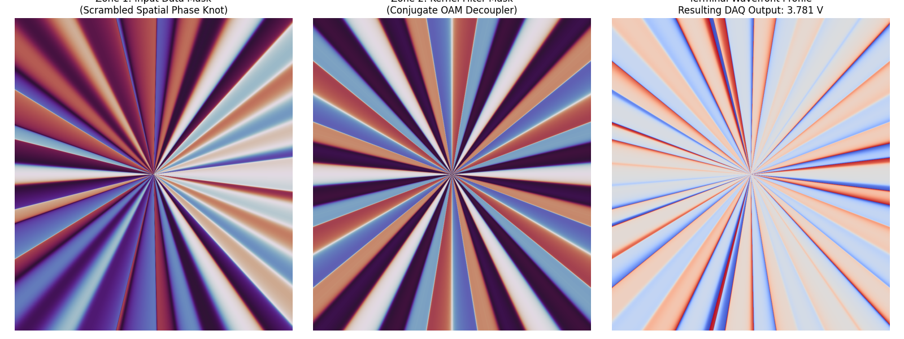

# qpc - Quantum Photonic Computer 

We [alter](#SLM) our [light](https://hubner-photonics.com/products/lasers/narrow-linewidth-lasers/08-01-series/) to twist it into whole numbers of phase twists per wavelength ($\lambda$). Twisting it to the left we use negative integers ($l=-24$) and to the right we go positive ($l=+24$). Each of these represents a distinct, orthogonal spatial channel where data can be encoded using amplitude (brightness, scaled 1–64).

Our architecture utilizes these discrete integer twists ($l=-24$ to $+24$) for high-dimensional multiplexing. Because each channel is mathematically orthogonal (e.g., $l=6$ will not inherently interfere with $l=5$), we can stack these modes simultaneously while keeping our channels clean. For this project, we'll be using 48 total channels, spanning from $l=-24$ to $+24$.

The quantum power of QTPC is achieved by using entangled photon pairs. In a classical system, two independent light beams would give us 96 channels ($48 + 48$). But by leveraging quantum entanglement, we utilize the high-dimensional state space (the density matrix) of the biphoton system, scaling our potential state space to $48 \times 48 = 2304$ joint channels. 

To illustrate, let's reduce our channels to just 4: $l=-2, -1, +1, +2$. Right at the moment of creation via Spontaneous Parametric Down-Conversion (SPDC), the photons exhibit strict OAM conservation ($l_A + l_B = 0$). This means if photon A has two twists to the left, photon B must have two twists to the right. With an even distribution, there is a $100\% / 4 = 25\%$ chance for each correlated state:

*(where $l_A$ is the twist count for photon A and $l_B$ is the twist count for photon B)*

| PHOTON A (Zone 1) \ PHOTON B (Zone 2) | $l=-2$ | $l=-1$ | $l=+1$ | $l=+2$ | Notes |
| :--- | :---: | :---: | :---: | :---: | :--- |
| **$l=-2$** | 0 | 0 | 0 | 0.25 | If $l_A = -2$, $l_B$ must be $+2$ |
| **$l=-1$** | 0 | 0 | 0.25 | 0 | If $l_A = -1$, $l_B$ must be $+1$ |
| **$l=+1$** | 0 | 0.25 | 0 | 0 | If $l_A = +1$, $l_B$ must be $-1$ |
| **$l=+2$** | 0.25 | 0 | 0 | 0 | If $l_A = +2$, $l_B$ must be $-2$ |

Directly after the entangled photons leave the [BBO crystal](https://www.newlightphotonics.com/SPDC-Components/BBO-SPDC-Compensators), we alter their wavefronts using a Spatial Light Modulator ([SLM](https://holoeye.com/product/leto-3-vis-009/)). By applying computed phase masks to the SLM, we manipulate the spatial superposition of the photon states. This shifts the joint probabilities measured at our detector array to look something like this:

| PHOTON A (Zone 1) \ PHOTON B (Zone 2) | $l=-2$ | $l=-1$ | $l=+1$ | $l=+2$ | Notes |
| :--- | :---: | :---: | :---: | :---: | :--- |
| **$l=-2$** | 0.0 | 0.65 | 0.0 | 0.35 | Encoded Data Row 1 |
| **$l=-1$** | 0.60 | 0.0 | 0.40 | 0.0 | Encoded Data Row 2 |
| **$l=+1$** | 0.0 | 0.25 | 0.0 | 0.75 | Encoded Data Row 3 |
| **$l=+2$** | 0.30 | 0.0 | 0.0 | 0.70 | Encoded Data Row 4 |

This end-result matrix is reconstructed by counting single-photon coincidence arrivals across our [sensor array](https://www.thorlabs.com/free-space-si-avalanche-photodetectors). The numbers `0.65` and `0.35` above correspond to 6,500 and 3,500 coincidence clicks registered over a 10,000-click sampling window. We control these statistical distributions by passing the photons through computer-generated holograms on our SLM, like the masks below:

## The Computational Advantage

In classical optics, combining and interfering light waves maps directly to linear algebraic transformations. 

By scaling this to a high-dimensional quantum system, passing the entangled photons through engineered SLM phases allows the system to perform complex spatial transformations across all 2,304 joint state values simultaneously. With a high-repetition-rate pump laser and fast coincidence counters, we aim to demonstrate massive parallel processing capabilities approaching GHz-scale effective state transformations.

# Is this real though?

Can we really alter the spatial superposition of two entangled photons to deliberately program their joint probability distributions, recombine them, sort their OAM modes, and read out the resulting matrix transformations?

# Join me and we will find out together!
### [Milestone 1](MILESTONE_1.md) <-- currently here
### [Milestone 2](MILESTONE_2.md)
